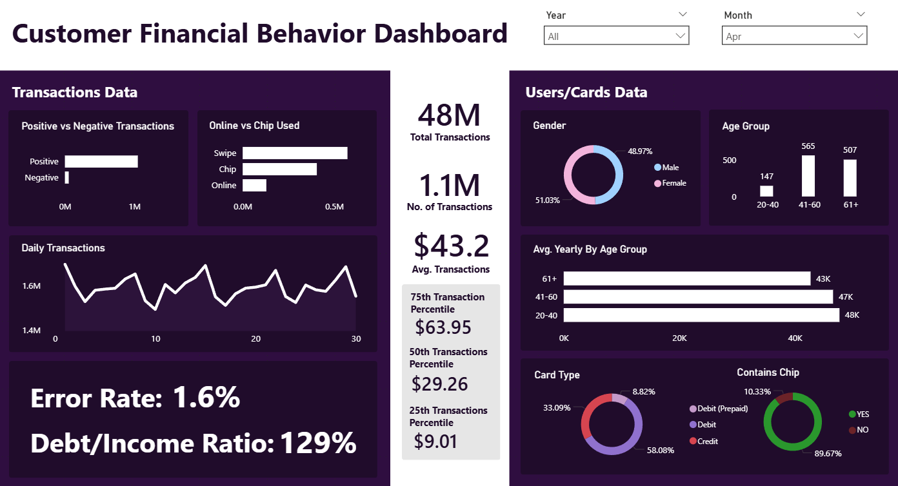
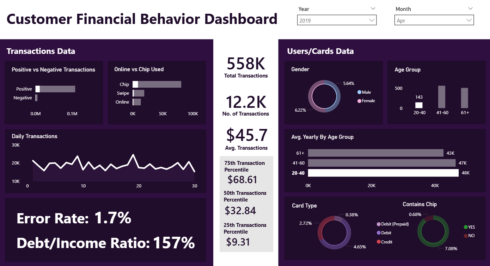

# Customer Financial Behavior Dashboard – Power BI  

This is my **first end-to-end project in Power BI**, where I built an interactive dashboard to analyze customer financial behavior.  

## Key Insights  
- Total & Average Transactions (with daily trends)  
- Transaction Percentiles (25th, 50th, 75th)  
- Error Rate & Debt/Income Ratio  
- Gender, Age Group, and Card Type distributions  

## Tech Stack  
- Power BI  
- DAX  
- Star Schema  
- Bi-Directional Filtering  

## Preview  
  
  
